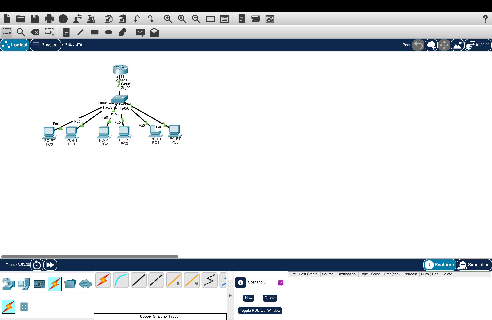
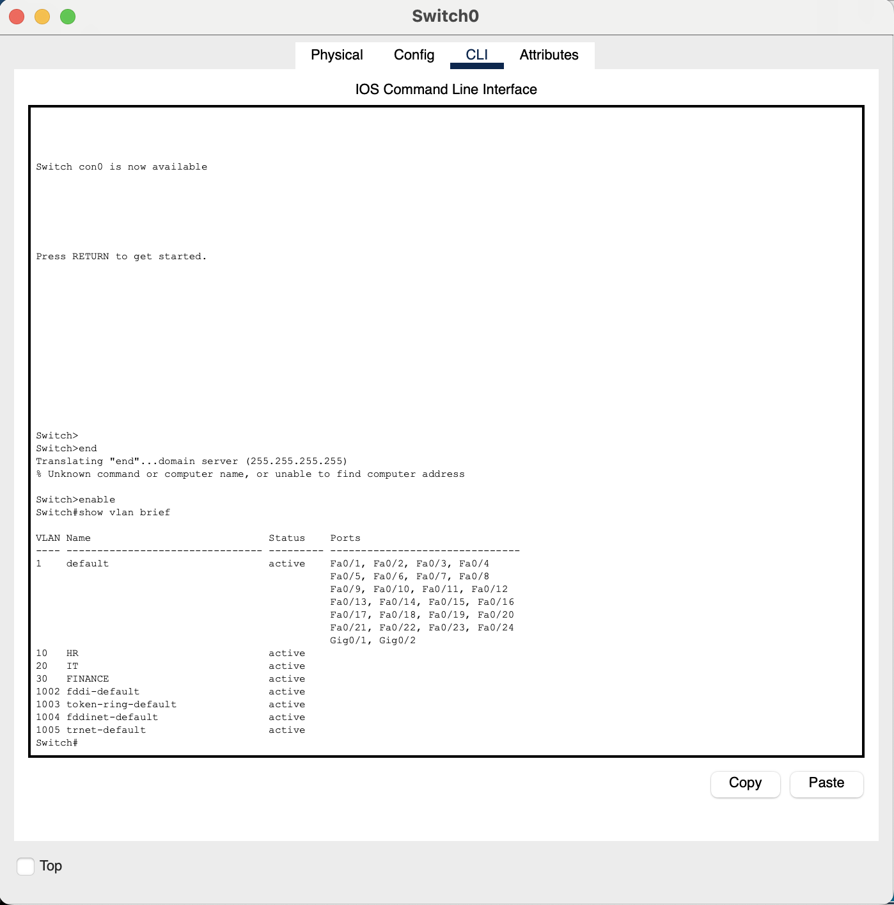
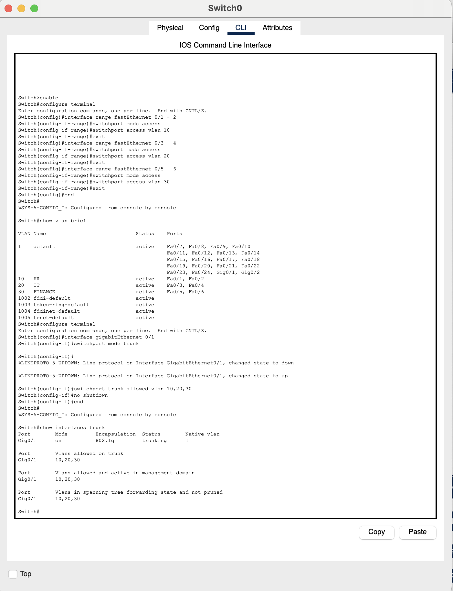
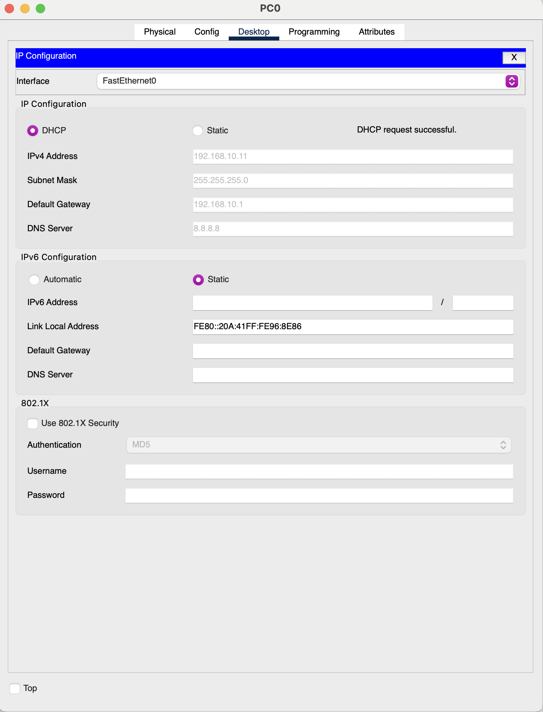
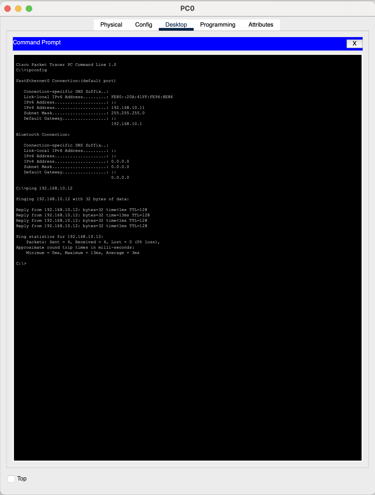
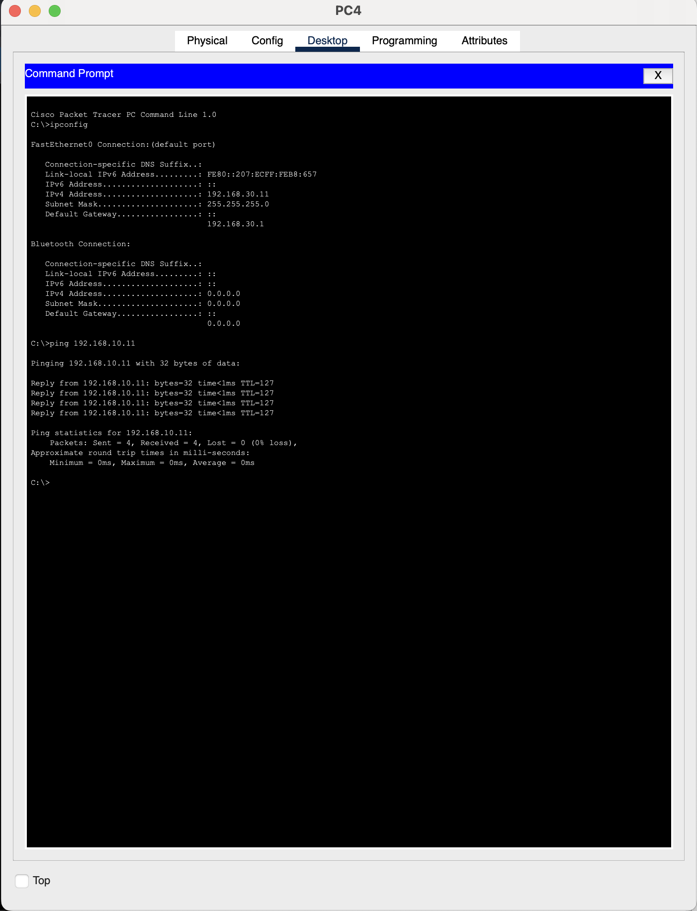

# Enterprise VLAN Network Lab

## Project Overview

This project demonstrates the design and configuration of a segmented enterprise network using Cisco Packet Tracer. The network was divided into three departmental VLANs representing HR, IT, and Finance.

The lab implements VLAN segmentation, access-port assignment, 802.1Q trunking, router-on-a-stick inter-VLAN routing, DHCP, and connectivity testing.

## Network Topology

The network consists of:

- 1 Cisco router
- 1 Cisco switch
- 6 client PCs
- 3 departmental VLANs

## VLAN and IP Addressing Scheme

| Department | VLAN | Network | Default Gateway |
|---|---:|---|---|
| HR | 10 | 192.168.10.0/24 | 192.168.10.1 |
| IT | 20 | 192.168.20.0/24 | 192.168.20.1 |
| Finance | 30 | 192.168.30.0/24 | 192.168.30.1 |

## VLAN Configuration

VLANs were created on the switch and access ports were assigned according to department:

- FastEthernet0/1–2 → VLAN 10 (HR)
- FastEthernet0/3–4 → VLAN 20 (IT)
- FastEthernet0/5–6 → VLAN 30 (Finance)

## 802.1Q Trunking

GigabitEthernet0/1 on the switch was configured as a trunk link carrying VLANs 10, 20, and 30 between the switch and router.

## Inter-VLAN Routing

Router-on-a-stick was implemented using router subinterfaces:

| Subinterface | VLAN | Gateway |
|---|---:|---|
| GigabitEthernet0/1.10 | 10 | 192.168.10.1 |
| GigabitEthernet0/1.20 | 20 | 192.168.20.1 |
| GigabitEthernet0/1.30 | 30 | 192.168.30.1 |

Each subinterface uses 802.1Q encapsulation for its corresponding VLAN, allowing the router to route traffic between the three networks.

## DHCP Configuration

The router was configured as the DHCP server for all three VLANs. Addresses `192.168.x.1` through `192.168.x.10` were excluded from each DHCP pool to reserve addresses for gateways and infrastructure.

Client devices automatically received an IPv4 address, `/24` subnet mask, appropriate default gateway, and DNS server information.

## Connectivity Testing

### Same-VLAN Connectivity

Connectivity between devices within the same VLAN was verified using ICMP ping testing.

### Inter-VLAN Connectivity

Connectivity was also tested between devices belonging to different VLANs. Successful ICMP responses demonstrated that the router-on-a-stick configuration was correctly routing traffic between VLANs.

The first ICMP request may time out while the devices perform ARP resolution. Subsequent responses confirm successful connectivity.

## Skills Demonstrated

- Cisco Packet Tracer
- IPv4 addressing and subnetting
- VLAN creation and segmentation
- Switch access-port configuration
- IEEE 802.1Q trunking
- Router-on-a-stick configuration
- Inter-VLAN routing
- DHCP configuration
- Default gateway configuration
- Cisco IOS CLI
- ICMP connectivity testing
- Basic network troubleshooting

## Project Files

- `Enterprise-VLAN-Network-Lab.pkt` — Complete Cisco Packet Tracer topology
- `router-config.txt` — Router configuration
- `switch-config.txt` — Switch configuration
- `Screenshots/` — Configuration and connectivity evidence

## Key Takeaway

This lab provided hands-on experience building a segmented network rather than placing all endpoints on a single broadcast domain. Configuring VLANs, trunking, DHCP, and inter-VLAN routing demonstrated how Layer 2 switching and Layer 3 routing work together to provide organized network communication between multiple departments.
